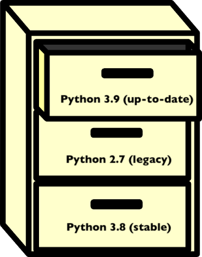

## Major Python versions

Let's assume that you are using a certain package in your data analysis project. That package may be required to run a
very specialized algorithm or to process some file format that is specific of your study domain. However, upon trying to
install the package (with a tool such as Pip, for example), you discover some sort of error. This error may be upon the
import, or even during the installation process.

This can be a common occurrence when working on programming projects, regardless of which language is being used. In
Python, errors can come up because of __version conflicts__, that is, two or more packages require different versions
of the same __dependency__. __A dependency is an independent package that another package requires to run.__ By logic,
the base dependency of all Python packages is the Python language itself. In order to run a Python project, we need
Python to be installed. However, there are important differences between major versions of Python, specially between
versions 2 and 3. From January 2020, [Python 2 has been deprecated](https://www.python.org/doc/sunset-python-2/) in favour
of Python 3, and there is even an [official guide](https://docs.python.org/3/howto/pyporting.html) and
[package](https://docs.python.org/3/library/2to3.html) for porting code from one version to the other.

There are plenty of systems running Python 2 in the wild, specially Python 2.7. It is common to have a "system-level"
installation of the Python language in an older version. Most modern Python packages, however,
may only support Python 3, as it is the current (and recommended) version of the language. In contrast, there are also
older Python packages that only run on Python 2, and thus may not run on our system if we are currently using Python 3.

__How can we deal with that?__

## Virtual environments

The answer to that is using __virtual environments__. We can think of an environment like a filing cabinet inside our
computer: for each drawer, we have an installation of Python, plus a number of additional packages.



Packages that are installed in an environment are restricted to that environment, and will not affect system-level
installs. Being able to isolate the installation of a specific version of Python or of a certain set of Python packages
is very important to organise our programming environment and to prevent conflicts.

Whenever we __activate__ a virtual environment, our system will start using that version of Python and packages installed
in that environment will become available. Environments can also be saved so that you can install all of the
packages and replicate the environment on a new system.

> ## Why use virtual environments?
> When we are unfamiliar with virtual environments, they may seem like an unnecessary hurdle. If the code runs on
> our current environment, why bother with the extra work of creating or using a different one? There are many reasons
> to use a virtual environment:
> 
>  - to prevent conflicts with system-level installations;
>  - to ensure consistency in the code that we deliver, _i.e.:_ keep it compatible with the same versions;
>  - to install our code in different environments, such as a server or cloud platform;
>  - to be able to share our environment with others (and prevent "works on my machine" errors).
> 
> Having isolated environments for each project greatly improves the organisation of our development environment. If 
> something goes wrong in an environment (for example, the installation of a package breaks, or there is a version
> conflict between distinct dependencies), we can simply delete that environment and recreate it. The rest of our system
> is not affected or compromised. This can be **critical** in multi-user environments.
> 
> Overall, we only need to learn the basics about virtual environments to be able to use them effectively. So, there is
> great benefit with relatively low effort.
{: .callout}

We can use the command-line to see which Python version is currently being used. This is the Python version that
is used to execute any scripts or Python files that we run from the command-line. There are many ways to do that, but
a simple one is to run:

```bash
which python
```

on Mac or LINUX, or:

```shell
where python
```

In Windows machines. The `which` and `where` commands point to the __Python executable__ that is currently active.
If we are using a virtual environment, that file will be inside our environment directory. If we see something like
`/usr/bin/python`, it is likely that we are using a system-level version of Python. If you are using an Anaconda
distribution of Python, it is likely that you will see `<path to your anaconda install>/bin/python`.

**Note: these commands can also be used to locate other executables.**

> ## Dependencies
> We've seen that dependencies are independent packages that are required for another package to run. Think of a
> particular package, either one that you want to create or one that you often use:
>   - what dependencies does it have?
>   - why is it important to keep track of these dependencies?
>   - what may happen if a dependency goes through a major version update?
> 
> > ## Solution
> >  - All Python packages obviously have the Python language as a dependency. For data analysis and scientific Python
> > projects, a very common dependency is the [NumPy](https://numpy.org/) package, that provides the basis for numerical
> > computing in Python, and additionally other common libraries of the scientific Python stack, such as
> > [Pandas](https://pandas.pydata.org/) and [Matplotlib](https://matplotlib.org/).
> >  - Keeping track of dependencies matters because our project depends on them to run correctly. If we are trying
> > use a function or method from a dependency that behaves differently in different versions, we may get unexpected
> > results. Also, it's important to know our dependencies' dependencies, which may sound like a lot, but it's something
> > occurs very often. If our dependency requires a package, then we also require that package.
> >  - If a dependency goes through a major version update, such as Python 2 to Python 3, there may be breaking changes
> > in downstream packages. If this happens for our package, we should test the package accordingly to see if everything
> > works as expected. Testing software is a vast topic and we can leave it for now, but it is important to have that in
> > mind when working with dependencies.
> {: .solution} 
{: .challenge}

## Environment and package managers

There are different strategies to deal with Python environments. We are going to focus on two of them: `virtualenv` and `conda`.

- `virtualenv` is a tool to create isolated Python environments. It is so widespread that a subset of it has been integrated
into the Python standard library under the [venv module.](https://docs.python.org/3/library/venv.html) `virtualenv` uses
`pip`, that we've discussed previously, to install and manage packages inside an environment. Therefore, `virtualenv` is
an __environment manager__ that is compatible with `pip`, a __package manager__. 

- `conda` is a tool from the [Anaconda distribution](http://anaconda.org/) that is both an environment and package manager.
Packages can be installed in Conda environments using both `pip` and `conda`. There are a fews advantages of using Conda
for installations, such as support for third-party packages (that aren't available on PyPI) and automatic dependency solving.
This comes at the disadvantage of being heavier and usually slower than `virtualenv`.
  
Because we are already familiar with `pip`, we can start off by using `virtualenv` to learn how environments work in
practice. We'll have a look at Conda environments later on.

> ## Installing `virtualenv`
> If you do not have `virtualenv` installed, you can quickly install it with `pip`:
> ```bash
> pip install virtualenv
> ```
{: .callout}

## Create an environment

Before we create an environment, let's see what happens when we import one of
our favorite packages. In a Python interpreter:

```python
import numpy
```

That should work, because we have the package installed on our system. If not,
use a package you know you have installed, or install NumPy.

Next, we'll create an environment named `myenv`:

```bash
virtualenv myenv -p python3
```

We could simply run `virtualenv myenv`, but the `-p python3` flag ensures that we create it with Python 3.

You will notice that a `myenv/` folder has been created in the working directory. We can then activate
our environment by running:

```bash
source myenv/bin/activate
```

Now we see that the CLI changes to show the environment name! We can also run the
`where` or `which` command again to see that our Python executable has been changed.

```bash
which python  # or 'where python' for Windows.
```

The output should look something like `<working directory>/myenv/bin/python`.

Let's start another Python interpreter (simply type `python`) and try to import NumPy again:

```python
import numpy
```

It does not work! This is expected, because we have just created this environment from scratch. It only contains the
base Python installation. To install NumPy in this environment, we must use `pip`:

```bash
pip install numpy
```

If we open a new Python interpreter, NumPy can now be imported.

## Listing packages and the requirements file.

We can check which packages are installed in our current environment using the `pip freeze` command. If we
wish to save that list in a file for later use, we can use a UNIX redirect statement (`>`). More on those on the
[SWC Shell Novice lesson](https://swcarpentry.github.io/shell-novice/04-pipefilter/index.html).

```bash
pip freeze > requirements.txt
```

This saves the list of packages and respective versions in the `requirements.txt` file. Requirement files are very
common in Python projects, as they are a simple way of specifying the project's dependencies.

## Deactivate an environment

When you're done with an environment, you can exit with the `deactivate` command.

```bash
deactivate
```

Not how the environment name disappears from the Shell prompt.

> ## Default environment
> Note that an environment is only activated in the current Terminal window. If you open a new
> Terminal, you'll be back to your default environment. This could be, for example, the `base` environment if you have
> Anaconda installed, or your system's default Python environment.
{: .callout}

> ## Using virtual environments
> To use what we've learned so far, try doing the following:
> - Find a project that interests you.
> - Download or clone the project's repository.
> - Create a new virtual environment for the project.
> - Use the project's `requirements.txt` file to install the dependencies.
>
> __Hint:__ use `pip install -h` to see the possible options for the `pip install` command.
>
> > ## Solution
> > We can use the [example-python-project](https://github.com/vinisalazar/example-python-project.git) from Episode 02
> > to demonstrate this:
> > ```bash
> > git clone https://github.com/vinisalazar/example-python-project.git
> > cd example-python-project
> > virtualenv example-env
> > source example-env/bin/activate
> > ```
> >
> > The `-r` flag in the `pip install` command allows installing a project's requirements from a text file:
> >
> > ```bash
> > pip install -r requirements.txt
> > ```
> {: .solution}
{: .challenge}

These are the basics of using `virtualenv` to create virtual environments. Alternatively, we could also use `conda`,
which is a more advanced package and environment manager. `conda` has several advantages over `virtualenv`, at the cost
of being heavier and slower.

## Conda environments
`conda` works similarly to `virtualenv`, but we use the `conda` command for managing both packages and environments
(with different subcommands, such as `conda create`, `conda install`, etc). If you are using Python for data analysis, 
chances are that you have it installed through Anaconda or Miniconda, as they are very popular distributions
of Python. Both Anaconda and Miniconda come with the `conda` environment manager, that can be used
from the command-line (if you have `(base)` in your Shell prompt, that means it's likely using the `base`,
or default, `conda` environment). Try typing `conda` in your Terminal. You should see something like the following:

```
usage: conda [-h] [-V] command ...

conda is a tool for managing and deploying applications, environments and packages.

Options:

positional arguments:
  command
    clean        Remove unused packages and caches.
    compare      Compare packages between conda environments.
    config       Modify configuration values in .condarc. This is modeled
                 after the git config command. Writes to the user .condarc
                 file (/Users/vini/.condarc) by default.
    create       Create a new conda environment from a list of specified
                 packages.
    help         Displays a list of available conda commands and their help
                 strings.
    info         Display information about current conda install.
    init         Initialize conda for shell interaction. [Experimental]
    install      Installs a list of packages into a specified conda
                 environment.
    list         List linked packages in a conda environment.
    package      Low-level conda package utility. (EXPERIMENTAL)
    remove       Remove a list of packages from a specified conda environment.
    uninstall    Alias for conda remove.
    run          Run an executable in a conda environment. [Experimental]
    search       Search for packages and display associated information. The
                 input is a MatchSpec, a query language for conda packages.
                 See examples below.
    update       Updates conda packages to the latest compatible version.
    upgrade      Alias for conda update.

optional arguments:
  -h, --help     Show this help message and exit.
  -V, --version  Show the conda version number and exit.
```
{: .output}

Differently than `virtualenv`, when we create a new environment with Conda, the folder containing the environment
is not created in the working directory, but rather in the `envs/` directory in thefolder where Anaconda or Miniconda is
installed. Let's create a Conda environment from scratch to demonstrate this.

## Creating and managing Conda environments

First, check out your current Python interpreter using `which python` or `where python`. If you are still using an
environment created with `virtualenv`, deactivate it using the `deactivate` command. Now, create a new environment
using `conda create`:

```bash
conda create -n example-env python=3.9
```

After a while, a prompt should appear confirming if you want to create the environment. Simply type `y` and press Enter.

In this command, the `-n` flag specifies the __name__ of our environment, and can be set to anything we like.
After the environment's name, we specify any packages that we want to install. In the example above, our command
specifies that we want the `example-env` to have Python and the Python version should be 3.9.
We could also specify `python=3` if we didn't care for the minor version number. 

To activate our newly created Conda environment, we use `conda activate`:
```bash
conda activate example-env
```

Similar to `virtualenv`, we should see `(example-env)` in our prompt, meaning the environment is active. If we run
`which python` again, it should point for a Python installation inside the `envs/` directory in our Anaconda folder:

```bash
which python
```
```
<path to anaconda folder>/envs/example-env/bin/python
```
{: .output}

## Installing packages from Conda channels

Now that we've activated our example environment, we can use the `conda install` command to install packages. If we 
consider the same `example-python-project` used in the previous examples, we can check the requirements file and
see that it has four dependencies: Pandas, NumPy, Matplotlib, and Seaborn. We could install the dependencies
like this:

```bash
conda install pandas seaborn -c conda-forge
```

Now, there are a couple of details to unpack in this simple command. First, why did we only include Pandas and
Seaborn in our command? Why didn't we include Matplotlib and NumPy? Second, what does the `-c conda-forge` option
do?

The answer to the first question is one of the cool things about using Conda: it automatically downloads dependencies
of packages we are attempting to install. In this case, NumPy is a dependency of Pandas and Matplotlib is a
dependency of Seaborn. Thus, we only need to install Pandas and Seaborn and the other two packages will automatically
be downloaded. `pip` also accounts for dependencies when installing new packages, but Conda's dependency __solver__ is
much more sophisticated, and ensures compatibility across all packages in our environment.

The second question is because of [__channels__][conda-channels] in Conda. Here, we are using the `conda-forge`
channel. Channels are repositories of packages, much like PyPI is the repository used by `pip`.
[Conda-forge](https://conda-forge.org/) is a well-stablished and community-driven repository for Conda packages (or
__recipes__, as they are called). Conda-forge has an
advanced infrastructure to automatically maintain and update Conda recipes, and is a reliable source for installing
packages through Conda. Check out their [docs](https://conda-forge.org/docs/) for more information. Other known
Conda channels include [Bioconda](https://bioconda.github.io/), which specializes in bioinformatics software, and
the [`R` channel](https://anaconda.org/r/repo), that provides packages for the R programming language.

> ## Searching for Conda packages
> To check if a package can be installed with Conda, go to [https://anaconda.org/](https://anaconda.org/) and use
> the search bar to search for the package's name. If the package is available through a Conda channel, it'll be listed
> here. By clicking on the package name, you can see the exact `conda` command to install it.
{: .callout}

After running the `conda install` command, we will get a prompt to confirm the installation, much like we did the 
`conda create` command. These prompts can be skipped by adding a `-y` flag to either commands.

## Listing packages and exporting a Conda environment

To list available packages in a Conda environment, we can run:
```bash
conda list
```

Note that the output of `conda list` is more detailed than `pip freeze`. It also includes build specification IDs and
channel information. To export that list to a file, we can use the `conda env export` command:

```bash
conda env export -f environment.yml --no-builds
```

Where the `-f` flag specifies the name of our output file and the `--no-builds` command specifies that we don't
wish to include the build specification numbers in our output (although it can be omitted). If we inspect that file,
we can note that it contains some extra information than the output of `pip freeze`, such as the environment name and
Conda channels that are included in the export (these two parameters can be configured with the `conda env export`
command.)

The resulting [YAML](https://yaml.org/) file can be used to recreate the environment in other systems, much like
the `pip install -r requirements.txt` command. For that, we can run:

```bash
conda env create -f environment.yml
```

And the environment will be recreated from the specified dependencies.

## Conclusion
Wow, that was a lot of commands in a single episode. And those were only the basics of using virtual environments!
However, we mustn't fret. It doesn't matter if we use `conda` or `virtualenv`, and different situations will call for
different tools, the important thing to remember is to understand the __importance__ of using virtual environments.
Having our environment isolated from the rest of our system is really good to prevent version conflicts, and "pinning"
our dependencies in a `requirements.txt` or `environment.yml` can be very helpful for other users to install the 
necessary packages to run our code.

> ## Official docs
> For more information on `conda` and `virtualenv`, check out the official documentation pages:
> - [Conda user guide](https://docs.conda.io/projects/conda/en/latest/user-guide/index.html)
> - [Virtualenv docs](https://virtualenv.pypa.io/en/latest/)
{: .callout}

[conda-channels]: https://docs.conda.io/projects/conda/en/latest/user-guide/concepts/channels.html


